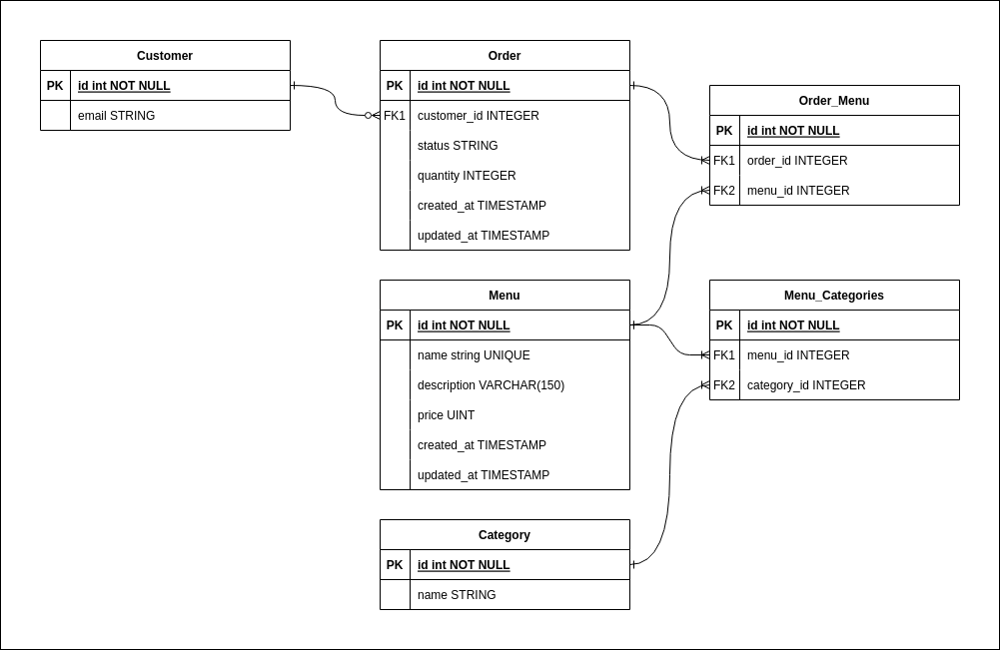

# GIGIH Final Project

## Preface
This is a final project made for Generasi GIGIH Backend Track. I find this final project kinda frustrating because its kinda hard for me (or that's my fault who did this task for only 2/3 days). But i learned much things from this project like how TDD Works, and much more about Rails framework, especially association.

Okay, i think i'm done with the chit chat. Let's get straight to the problem. So in this documentation, i'd like to explain some thing about this projects. The explanation i want to tell is: 
- Database Design
- TDD on this project
- Library / Dependency used
- How to run this project
- Unfinished things (Yes, this project is not 100% finished.)

## Database Design

### Before you ask:
- **Why use Many to Many on Categories?**
> Because i assume the category is already fixed. My assumption is, the category is already there and we can't make a new category. Therefore, i make it many to many

- **Do you use nested attribute?**
> No

### Database
Yes, this is my database design. For problem statement 1 until 4 i only use three tables, which are `Menu`, `Category`, and `Menu_Categories`. Then from problem statement 5 until 7, i add the remaining tables which are `Customer`, `Order`, and `Order_Menu`. 

## TDD on This Project
Yes, for the early problem statement, i used TDD. But i don't have much time to use TDD on all things. So at problem statement 7, i didn't use TDD anymore. 

For TDD process, you can take a look at my this project commits. I do **Red - Green** method, but didn't have much time to **Refactor** so i did some **Refactor** at the end.

## Library / Dependency Used
Because there's many **impossible** problem statement, i need some library/dependency to solve them such as: 
- `email_validator` for validating email (Bonus point in problem statement 5)
- `whenever` for scheduling daily updates (Bonus point in problem statement 6) (Planned, not implemented yet)

## How to Run Rails
Well, this is step by step how to run this project: 
1) Run `bundle install` to install the required packages
2) After the required packages are installed, then run `bin/rails server`
3) **Optional** if you want to run the tests, just run `rspec -fd` in the terminal.

## Uncompleted Things (I'm sorry for this)
There's many uncompleted things in this project. I know i suck because i can't complete the project on time, but here's the uncompleted things: 
1) Web UI / API (As far, i only implemented **unit test** and **logic**)
2) Problem Statement 7 (Daily Report)